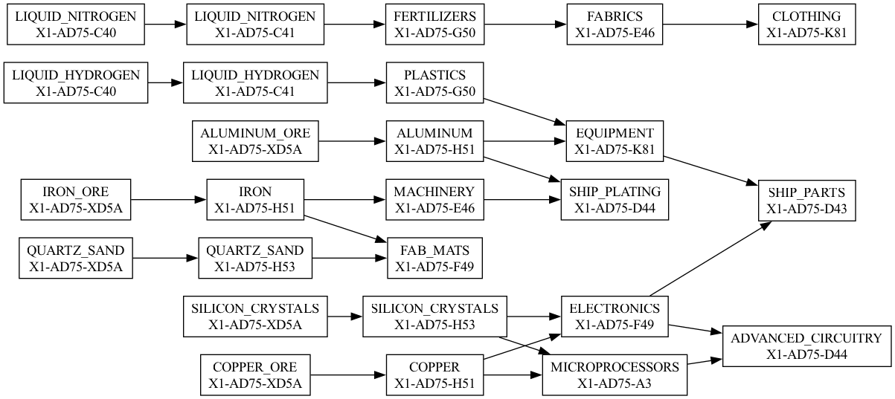
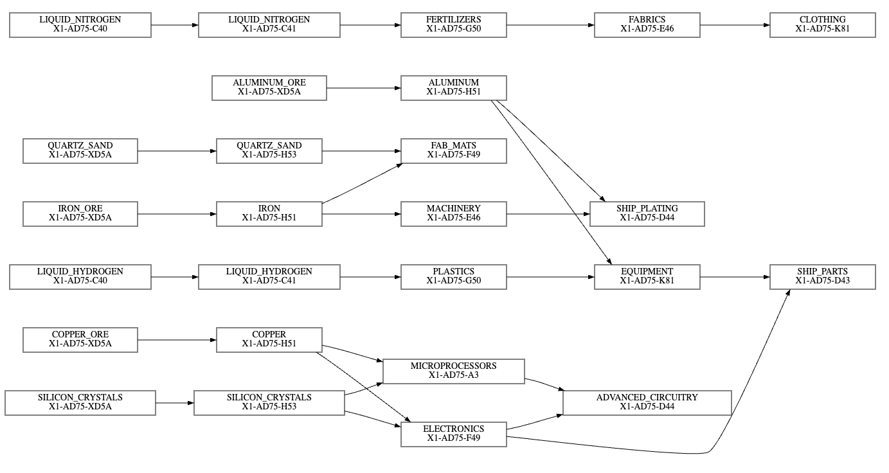

# graph layout experiments

Manual code (generated by claude) is kinda bad. The computation of the positions is not good.

##  graphviz vs. layout-crate

layout crate is awesome, easy to use API :)

the graphviz lib generates a slightly better graph
- fewer intersections
  - see edges originating at ALUMINIUM
- better routing
  - edge from ELECTRONICS to SHIP_PARTS

### graphviz output

```sh
dot -Tpng spacetraders.dot -o output.png
```



### layout-crate output

```sh
cargo run --bin layout_engine
```



## debug output

```text
rank(row: 0, col: 0);  (y:  49, x:  147);   node: LIQUID_NITROGEN - X1-AD75-C40
rank(row: 1, col: 0);  (y: 245, x:  147);   node: QUARTZ_SAND - X1-AD75-XD5A
rank(row: 2, col: 0);  (y: 343, x:  147);   node: IRON_ORE - X1-AD75-XD5A
rank(row: 3, col: 0);  (y: 441, x:  147);   node: LIQUID_HYDROGEN - X1-AD75-C40
rank(row: 4, col: 0);  (y: 539, x:  147);   node: COPPER_ORE - X1-AD75-XD5A
rank(row: 5, col: 0);  (y: 637, x:  147);   node: SILICON_CRYSTALS - X1-AD75-XD5A
rank(row: 0, col: 1);  (y:  49, x:  441);   node: LIQUID_NITROGEN - X1-AD75-C41
rank(row: 1, col: 1);  (y: 147, x:  441);   node: ALUMINUM_ORE - X1-AD75-XD5A
rank(row: 2, col: 1);  (y: 245, x:  441);   node: QUARTZ_SAND - X1-AD75-H53
rank(row: 3, col: 1);  (y: 343, x:  441);   node: IRON - X1-AD75-H51
rank(row: 4, col: 1);  (y: 441, x:  441);   node: LIQUID_HYDROGEN - X1-AD75-C41
rank(row: 5, col: 1);  (y: 539, x:  441);   node: COPPER - X1-AD75-H51
rank(row: 6, col: 1);  (y: 637, x:  441);   node: SILICON_CRYSTALS - X1-AD75-H53
rank(row: 0, col: 2);  (y:  49, x:  728);   node: FERTILIZERS - X1-AD75-G50
rank(row: 1, col: 2);  (y: 147, x:  728);   node: ALUMINUM - X1-AD75-H51
rank(row: 2, col: 2);  (y: 245, x:  728);   node: FAB_MATS - X1-AD75-F49
rank(row: 3, col: 2);  (y: 343, x:  728);   node: MACHINERY - X1-AD75-E46
rank(row: 4, col: 2);  (y: 441, x:  728);   node: PLASTICS - X1-AD75-G50
rank(row: 5, col: 2);  (y: 588, x:  728);   node: MICROPROCESSORS - X1-AD75-A3
rank(row: 6, col: 2);  (y: 686, x:  728);   node: ELECTRONICS - X1-AD75-F49
rank(row: 0, col: 3);  (y:  49, x: 1029);   node: FABRICS - X1-AD75-E46
rank(row: 1, col: 3);  (y: 343, x: 1029);   node: SHIP_PLATING - X1-AD75-D44
rank(row: 2, col: 3);  (y: 441, x: 1029);   node: EQUIPMENT - X1-AD75-K81
rank(row: 3, col: 3);  (y: 637, x: 1029);   node: ADVANCED_CIRCUITRY - X1-AD75-D44
rank(row: 0, col: 4);  (y:  49, x: 1302);   node: CLOTHING - X1-AD75-K81
rank(row: 1, col: 4);  (y: 441, x: 1302);   node: SHIP_PARTS - X1-AD75-D43
```
